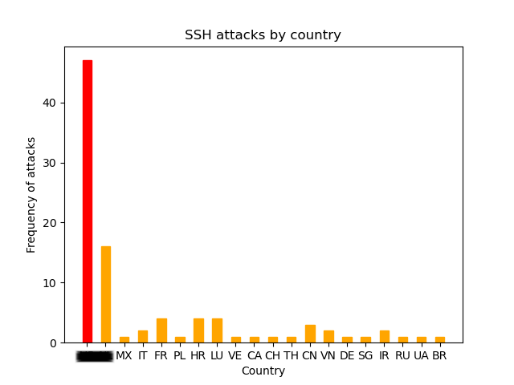
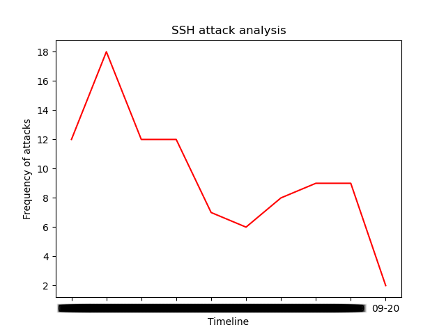

## Fail2ban Log Analysis Script
This script automatically parses fail2ban log and generates statistics on detected attacks





## Requirements:
- Python 3.x
- python-geoip
- python-geoip-geolite2
- matplotlib

## Features:
- Uses offline geoip database to lookup country
- Also supports online ip lookup

```
Usage: python3 parse-log.py fail2ban.log
```

